# 🔵+ Track 2 Plus. Connector & Custom Agent

<div class="track-slide-bar" style="border-color: var(--google-blue);">
  <span class="track-slide-label">🔗 커넥터 & 커스텀 에이전트 심화 실습</span>
  <a href="slide_track2plus.html" target="_blank" class="track-slide-btn" style="color: var(--google-blue);">📽️ 슬라이드로 강의 시작 →</a>
</div>

Google Drive / Workspace 커넥터 연동과 Python 기반 커스텀 에이전트 개발을 다루는 심화 과정입니다. 어드민이 사전에 커넥터 또는 커스텀 에이전트 환경을 구성한 경우에만 진행합니다.

> [!NOTE]
> **🔧 사전 확인 사항**
>
> 이 트랙은 Gemini Enterprise 어드민이 아래 환경을 사전 구성한 경우에만 진행할 수 있습니다.
> - **Part A**: Google Drive / Workspace 커넥터 활성화 완료
> - **Part B**: Cloud Run 기반 커스텀 에이전트 배포 및 GE 등록 완료
>
> 환경이 준비되지 않은 경우 강사에게 문의하세요.

<div class="download-card">
  <div class="download-card-left">
    <div class="download-icon-box" style="background: #e8f0fe; color: #1a73e8;">📦</div>
    <div class="download-text">
      <h4>Track 2 Plus 실습 파일 다운로드</h4>
      <p>Part A.2 RAG 실습에 사용할 샘플 문서 3종을 미리 다운로드합니다. Drive 또는 GCS에 업로드할 때 사용합니다.</p>
    </div>
  </div>
  <div style="display: flex; gap: 8px; flex-wrap: wrap;">
    <a href="samples/%5B공통_내규%5D_넥스트_테크놀로지스_임직원_복리후생_가이드라인.pdf" download class="download-btn" style="background: #1a73e8; padding: 10px 16px; font-size: 0.9rem;">📕 복리후생 가이드라인.pdf</a>
    <a href="samples/%5B마케팅_캠페인%5D_넥스트_테크놀로지스_사내_브랜드_앰버서더_프로그램_가이드라인.pdf" download class="download-btn" style="background: #e8710a; padding: 10px 16px; font-size: 0.9rem;">📕 앰버서더 프로그램 가이드라인.pdf</a>
    <a href="samples/track2_rag_policy.md" download class="download-btn" style="background: #34a853; padding: 10px 16px; font-size: 0.9rem;">📄 AI 윤리 및 보안 규정.md</a>
  </div>
</div>
<div class="verify-card" data-verify-id="track2plus-data">
  <div class="verify-checkbox"></div>
  <span>Part A.2 실습에 사용할 샘플 파일 3종을 다운로드하고 Google Drive 또는 GCS에 업로드하였습니다.</span>
</div>

---

## Part A. Connector 실습

### A.1. Google Drive & Workspace 권한 승인

구글 드라이브, 캘린더, Gmail 등을 연동해 사내 문서 검색이나 요약, 일정 관리를 자동화하기 위해 사용자가 최초 1회 권한 승인을 완료하는 프로세스입니다.

구글 드라이브, 캘린더, Gmail 등을 연동해 사내 문서 검색이나 요약, 일정 관리를 자동화하려면 먼저 권한 승인이 필요합니다. 실습 과정 중 연동 권한을 요구하는 팝업(넛지)이 나타나면, 제공받은 구글 계정으로 로그인하여 권한 승인을 완료해 줍니다.

> [!NOTE]
> **🔧 사전 확인 사항**
>
> Drive 커넥터 연동은 Gemini Enterprise 어드민이 조직 단위로 활성화한 경우에만 사용할 수 있습니다. 커넥터 목록이 보이지 않거나 **Enable actions** 버튼이 없다면, 강사 또는 관리자에게 먼저 문의하세요.

권한 승인 절차는 다음과 같습니다.

1. 대화창 오른쪽의 **커넥터 아이콘**을 클릭해 커넥터 목록을 열고, **Drive** 항목의 **Enable actions** 버튼을 클릭합니다.

   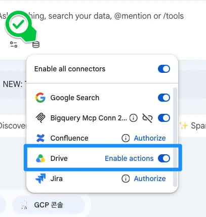

2. 구글 계정 선택 팝업이 뜨면 실습에 제공된 계정을 선택합니다.

   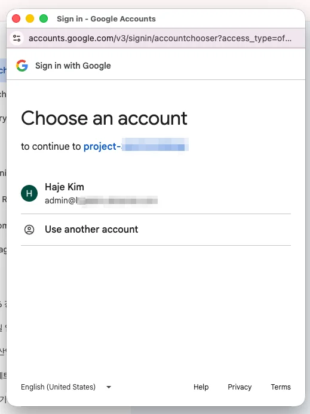

3. 권한 요청 화면에서 Drive 파일 접근을 포함한 권한 목록을 확인하고 **Allow**를 클릭합니다.

   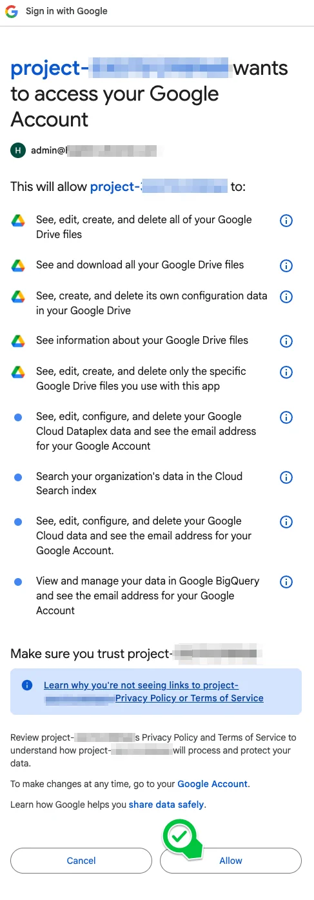

4. Drive 항목이 **Disable actions** 버튼으로 바뀌면 Google Drive 연동이 완료된 것입니다.

   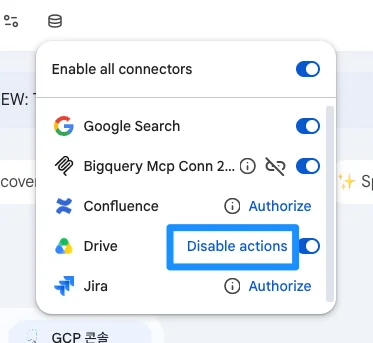

> [!TIP]
> **💡 OAuth 팝업 차단 트러블슈팅**
>
> 구글 드라이브나 Workspace 연동 중 계정 선택 팝업이 나타나지 않고 무한 로딩이 걸릴 때는, 브라우저 주소창 오른쪽 끝의 **팝업 차단 아이콘**을 클릭해 **'항상 허용'**으로 바꾼 뒤 페이지를 새로고침합니다. 크롬에서 최초 연동 시 자주 발생하는 현상입니다.

---

### A.2. 사내 정보 검색 및 클라우드 지식 RAG 탐색
 
사내 드라이브나 클라우드 스토리지에 올려둔 문서를 바로 검색하고 답변을 받을 수 있습니다. 이것이 RAG입니다.

> [!NOTE]
> **🔗 사전 요건**
>
> 이 섹션은 **A.1 Google Drive 권한 승인**이 완료된 상태에서 진행합니다. 아직 완료하지 않았다면 A.1로 돌아가 Drive 연동을 먼저 마쳐 주세요.

#### 💻 실습 준비: 원천 문서 다운로드 및 업로드
사내 데이터 RAG 환경을 직접 검증해보기 위해 아래 가이드라인 파일을 로컬에 다운로드한 후, 실습용 구글 드라이브(또는 지정된 클라우드 스토리지)에 업로드해 줍니다.

1. **Google Drive RAG 실습용 샘플** (원하는 파일 포맷을 다운로드하여 사용하세요):
   - **PDF 버전 (추천)**: <a href="./samples/%5B공통_내규%5D_넥스트_테크놀로지스_임직원_복리후생_가이드라인.pdf" target="_blank">📕 [공통_내규] 넥스트 테크놀로지스 임직원 복리후생 가이드라인.pdf</a>
   - **Markdown 버전**: <a href="./samples/%5B공통_내규%5D_넥스트_테크놀로지스_임직원_복리후생_가이드라인.md" target="_blank">📄 [공통_내규] 넥스트 테크놀로지스 임직원 복리후생 가이드라인.md</a>
2. **GCS RAG 실습용 샘플** (원하는 파일 포맷을 다운로드하여 사용하세요):
   - **PDF 버전 (추천)**: <a href="./samples/%5B마케팅_캠페인%5D_넥스트_테크놀로지스_사내_브랜드_앰버서더_프로그램_가이드라인.pdf" target="_blank">📕 [마케팅_캠페인] 넥스트 테크놀로지스 사내 브랜드 앰버서더 프로그램 가이드라인.pdf</a>
   - **Markdown 버전**: <a href="./samples/%5B마케팅_캠페인%5D_넥스트_테크놀로지스_사내_브랜드_앰버서더_프로그램_가이드라인.md" target="_blank">📄 [마케팅_캠페인] 넥스트 테크놀로지스 사내 브랜드 앰버서더 프로그램 가이드라인.md</a>
3. **추가 Drive RAG 실습용 샘플** — AI 윤리 및 보안 규정 문서:
   - <a href="./samples/track2_rag_policy.md" target="_blank">📄 사내 AI 윤리 및 클라우드 데이터 보안 규정.md</a> — 다운로드 후 Google Drive에 업로드하여 RAG 질의에 활용합니다.

---

- **실습 예시 1 (내부 규정 검색 - Google Drive)**:
  사내 드라이브에 업로드한 임직원 복리후생 가이드라인 문서를 RAG 검색합니다.

  ```markdown
  내 드라이브에 있는 "복리후생" 문서를 기반으로 자녀 학자금 지원 한도가 재직 기간에 따라 어떻게 다른지 알려줘
  ```

  채팅창 왼쪽 아래 커넥터 아이콘을 클릭합니다. Google Search는 OFF로 끄고, Drive만 켜둡니다(Disable actions 상태). Google Search가 켜져 있으면 드라이브 대신 인터넷을 검색합니다.

  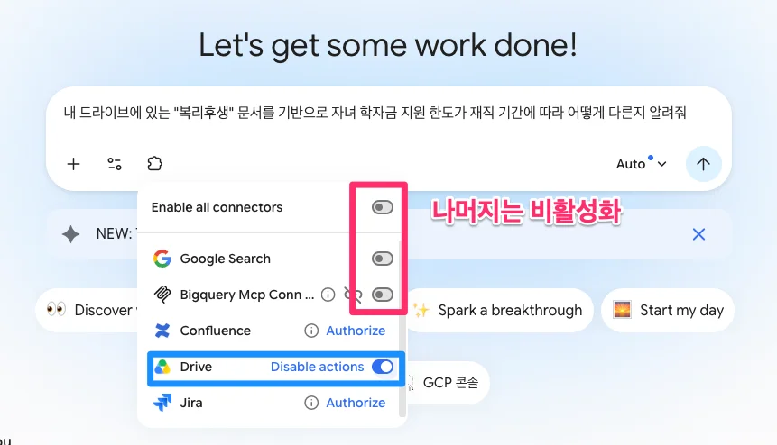

  *(Drive를 처음 연동하는 경우 OAuth 팝업이 나타납니다. 아래 화면을 따라 승인합니다.)*

  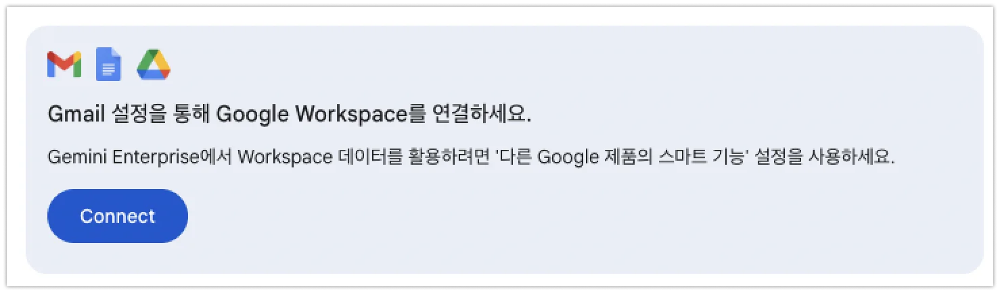
  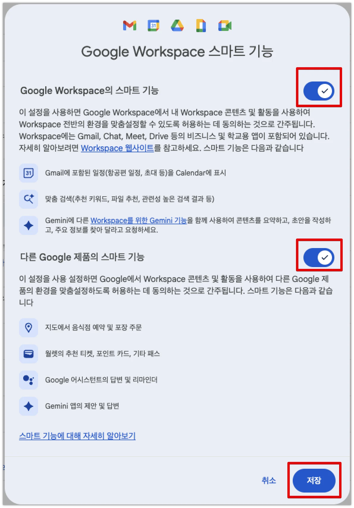

  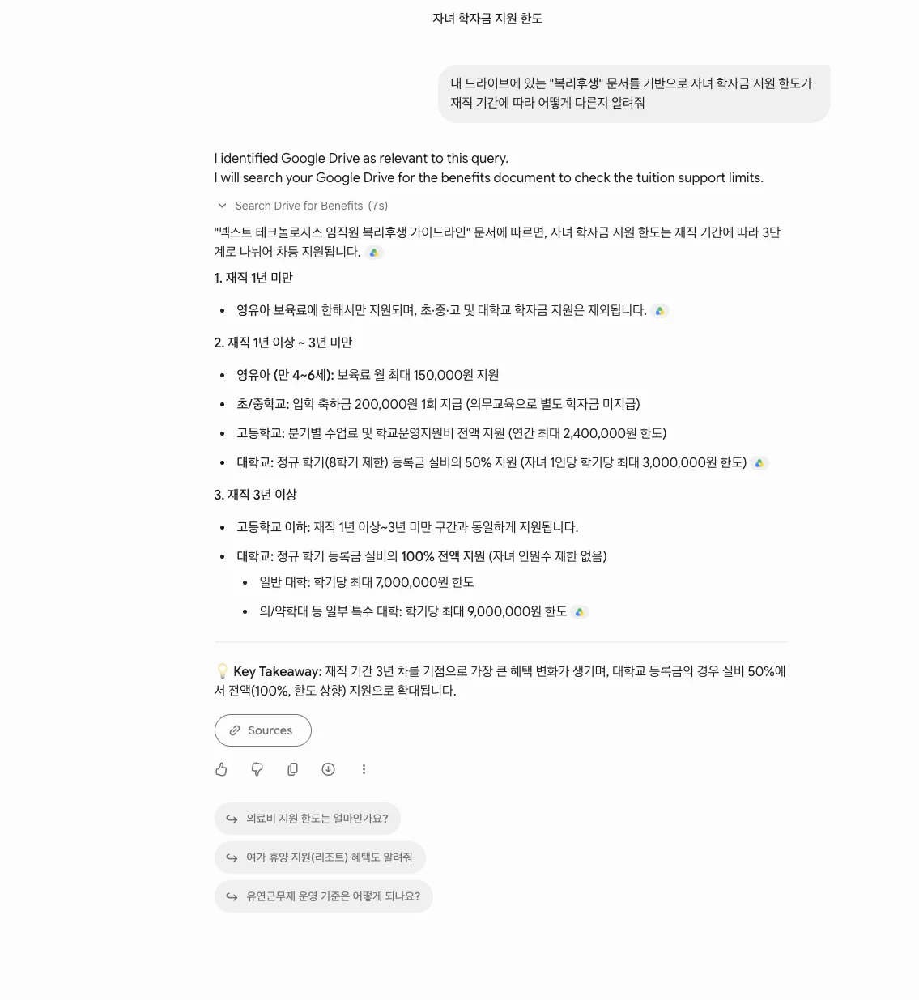
  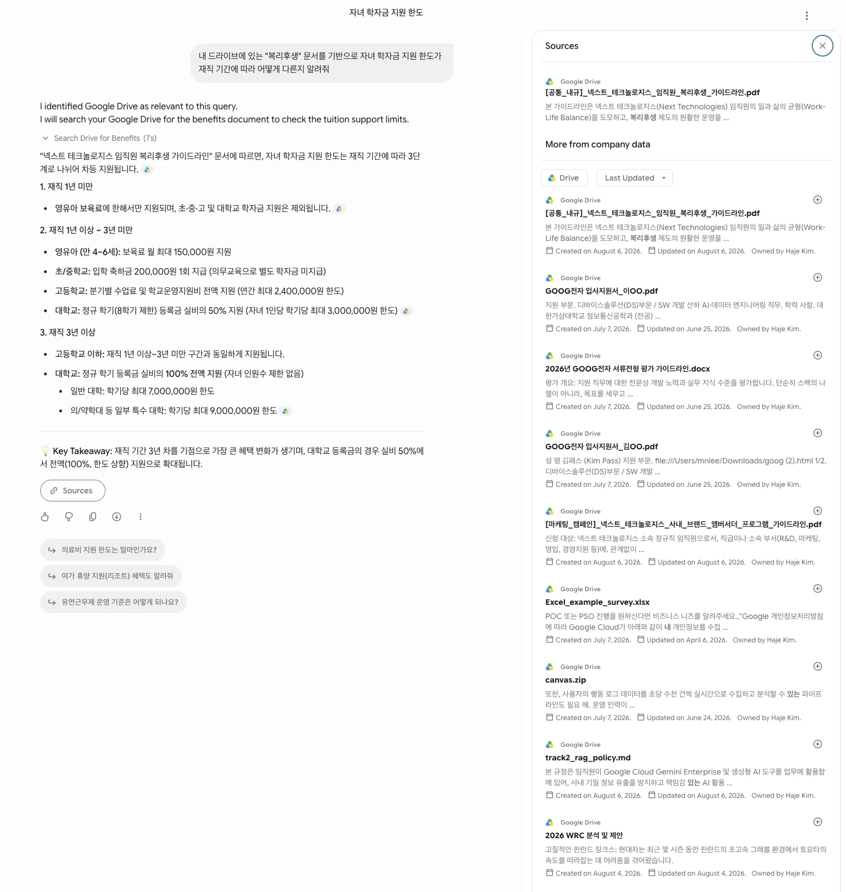

- **실습 예시 2 (GCS 사설 데이터베이스 RAG 검색)**:
  구글 클라우드 스토리지(GCS) 버킷에 사내 특수 마케팅 캠페인 및 일정 데이터를 보관해 둔 상황을 전제하여 쿼리해 봅니다.

  > [!IMPORTANT]
  > **🛠️ 관리자 사전 설정 체크리스트 (GCS RAG 실습 전 필수)**
  >
  > 아래 항목은 고객사 **클라우드 인프라 관리자**가 사전에 완료해야 합니다. 미완료 시 해당 실습은 건너뛰고 대안(아래 참고)을 활용하세요.
  >
  > - [ ] GCP 프로젝트에 GCS 버킷 생성 및 실습용 샘플 파일 적재 완료
  > - [ ] Vertex AI Search 데이터스토어(Data Store) 생성 및 GCS 버킷 연결 완료
  > - [ ] Gemini Enterprise 어드민 콘솔 → 커넥터 설정에서 GCS 커넥터 활성화 완료
  > - [ ] Service Account에 `roles/discoveryengine.viewer` 권한 부여 완료
  > - [ ] 실습 참가자 계정에 해당 데이터스토어 접근 IAM 권한 부여 완료
  >
  > **⚡ GCS 환경이 준비되지 않은 경우 대안**: 이 샘플 파일을 Google Drive에 업로드한 뒤 Workspace RAG 방식으로 동일하게 질문을 테스트할 수 있습니다.
  ```markdown
  넥스트 테크놀로지스의 사내 브랜드 앰버서더 참여 요건과 전용 VIP 혜택이 무엇인지 요약해줘
  ```

  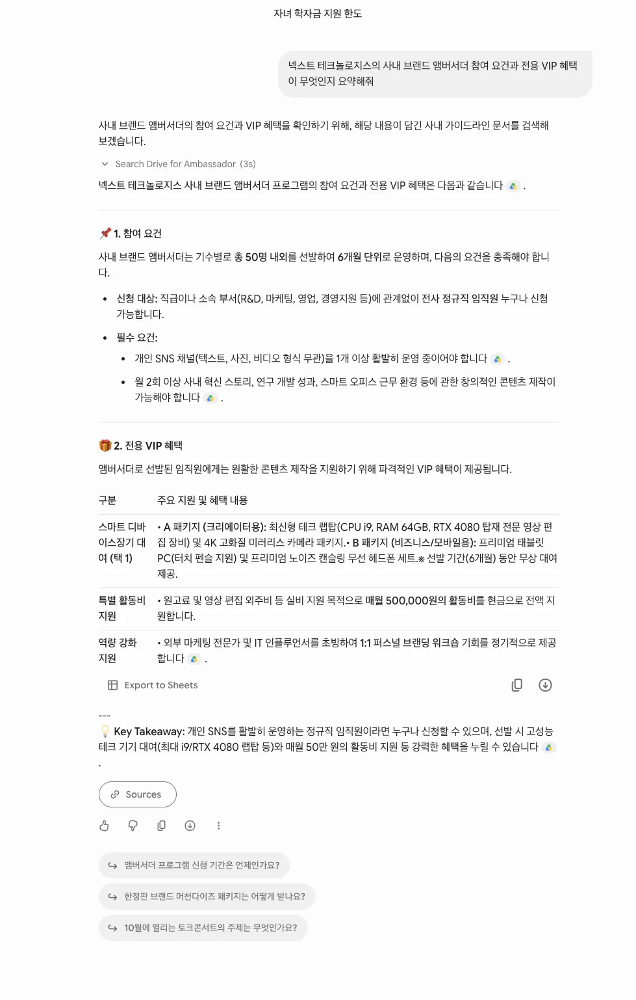
  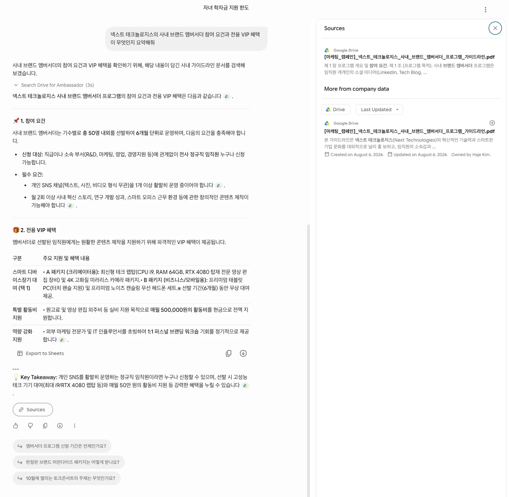

  ```markdown
  넥스트월드 토크콘서트 개최 일정, 시간, 대강당 위치, 그리고 초청 강사를 정확히 가이드해줘
  ```

  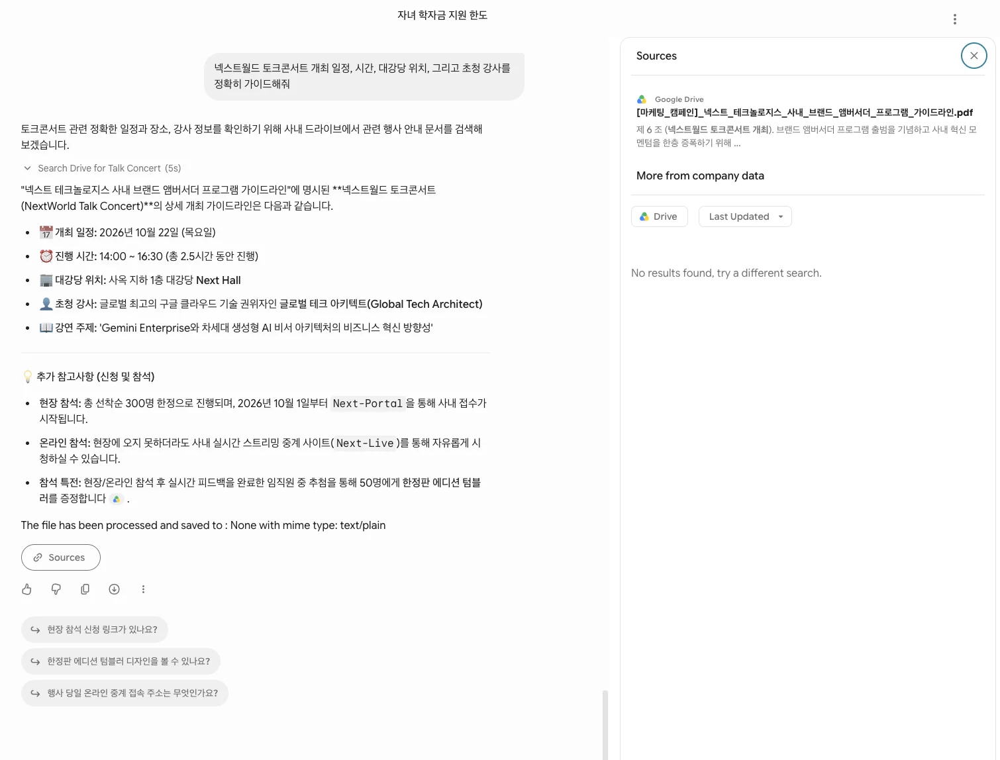

> [!TIP]
> **💡 RAG-Ready: 검색 정확도를 높이는 문서 작성 가이드**
>
> Gemini의 사내 지식 기반 RAG(Retrieval-Augmented Generation) 검색 정확도는 원본 문서의 구조와 정돈 상태에 직접적인 영향을 받습니다. 사내 문서를 업로드하기 전, 아래의 <b>RAG-Ready 표준 수칙</b>을 적용하면 오답(환각)을 방지하고 정확한 출처 인용 결과를 얻을 수 있습니다.
> 
> 1. **시각 자료의 텍스트 병기 (OCR 상호 보완)**:
>    - 차트, 다이어그램, 아키텍처 등 이미지 내의 핵심 데이터는 반드시 하단에 **텍스트 요약 및 표(Table)** 형태로 한 번 더 기술합니다. Gemini가 다중 모달(Multimodal) 분석을 수행하지만, 구조화된 텍스트가 병기되었을 때 임베딩 검색 정확도가 높아집니다.
> 2. **명확한 헤딩(Heading) 계층 구조화**:
>    - 문서 작성 시 제목과 본문의 스타일 태그(H1, H2, H3 등)를 명확히 구분하여 작성합니다. 장황하게 나열된 텍스트보다 명확한 단락 구분과 계층 구조가 적용된 문서가 청킹(Chunking) 및 시맨틱 검색 시 관련성 스코어를 훨씬 높게 받습니다.
> 3. **버전 관리 및 최신본 동기화**:
>    - 동일한 파일의 구버전과 신버전이 구글 드라이브나 스토리지에 중복 존재하지 않도록 관리합니다. 구버전 문서가 방치되면 LLM이 상충되는 정보 중 어떤 것이 최신인지 판단하기 어려워 구버전 정보를 인용할 위험이 있습니다. 주기적으로 아카이브 전용 폴더로 구버전 문서를 이관 처리합니다.

---

## Part B. Custom Agent 개발

### B.1. 커스텀 에이전트 및 ADK/CAA 개발

에이전트를 코드로 개발하여 Cloud Run 또는 Agent Runtime에 배포한 뒤, A2A(Agent-to-Agent) 프로토콜을 통해 Gemini Enterprise 에이전트로 등록할 수 있습니다.

> [!NOTE]
> **🔧 사전 확인 사항**
>
> 마지막 단계인 Gemini Enterprise 어드민 콘솔 에이전트 등록은 관리자 권한이 필요합니다. 실습 시작 전 강사 또는 관리자에게 등록 지원 가능 여부를 미리 확인하세요.

<div style="display: flex; align-items: stretch; gap: 8px; margin: 1.5rem 0; flex-wrap: wrap;">
  <div style="flex: 1; min-width: 130px; background: #e8f0fe; border: 1px solid #1a73e8; border-radius: 10px; padding: 0.8rem 0.6rem; text-align: center;">
    <div style="font-size: 1.4rem; margin-bottom: 4px;">🛠️</div>
    <div style="font-weight: 700; color: #1a73e8; font-size: 0.88rem;">① ADK로 개발</div>
    <div style="font-size: 0.73rem; color: #5f6368; margin-top: 3px;">Python / TypeScript / Go</div>
  </div>
  <div style="display: flex; align-items: center; color: #9aa0a6; font-size: 1.1rem; flex-shrink: 0; padding: 0 2px;">→</div>
  <div style="flex: 1; min-width: 130px; background: #e6f4ea; border: 1px solid #34a853; border-radius: 10px; padding: 0.8rem 0.6rem; text-align: center;">
    <div style="font-size: 1.4rem; margin-bottom: 4px;">🔗</div>
    <div style="font-weight: 700; color: #137333; font-size: 0.88rem;">② to_a2a() 래핑</div>
    <div style="font-size: 0.73rem; color: #5f6368; margin-top: 3px;">A2A 변환 · Agent Card 자동 생성</div>
  </div>
  <div style="display: flex; align-items: center; color: #9aa0a6; font-size: 1.1rem; flex-shrink: 0; padding: 0 2px;">→</div>
  <div style="flex: 1; min-width: 130px; background: #fef7e0; border: 1px solid #f9ab00; border-radius: 10px; padding: 0.8rem 0.6rem; text-align: center;">
    <div style="font-size: 1.4rem; margin-bottom: 4px;">☁️</div>
    <div style="font-weight: 700; color: #e37400; font-size: 0.88rem;">③ Cloud Run 배포</div>
    <div style="font-size: 0.73rem; color: #5f6368; margin-top: 3px;">adk deploy cloud_run</div>
  </div>
  <div style="display: flex; align-items: center; color: #9aa0a6; font-size: 1.1rem; flex-shrink: 0; padding: 0 2px;">→</div>
  <div style="flex: 1; min-width: 130px; background: #fce8e6; border: 1px solid #ea4335; border-radius: 10px; padding: 0.8rem 0.6rem; text-align: center;">
    <div style="font-size: 1.4rem; margin-bottom: 4px;">🏢</div>
    <div style="font-weight: 700; color: #c5221f; font-size: 0.88rem;">④ Gemini Enterprise 등록</div>
    <div style="font-size: 0.73rem; color: #5f6368; margin-top: 3px;">어드민 콘솔 → Custom agent via A2A</div>
  </div>
</div>

#### 개발 파이프라인

**① + ② ADK 에이전트 작성 & to_a2a() 래핑**

[ADK(Agent Development Kit)](https://adk.dev/)로 Python 에이전트를 작성하고, `to_a2a()` 함수 한 줄로 A2A 프로토콜 호환 서버로 변환합니다. `to_a2a()`는 에이전트의 이름·설명·스킬 정보를 자동으로 읽어 **Agent Card JSON을 생성**하므로 별도 설정이 필요 없습니다.

```python
from google.adk.agents import Agent
from google.adk.a2a.utils import to_a2a

def my_tool(query: str) -> str:
    # 비즈니스 로직 구현
    return result

root_agent = Agent(
    model='gemini-2.5-flash',
    name='my_agent',
    description='업무 자동화 에이전트',
    tools=[my_tool],
)

# A2A 서버 변환 + Agent Card 자동 생성
app = to_a2a(root_agent)
```

**③ Cloud Run 배포**

```bash
adk deploy cloud_run \
  --service_name=my-agent \
  --project $PROJECT \
  --region $REGION \
  --a2a my_agent/
```

배포가 완료되면 Agent Card가 `<Cloud Run URL>/a2a/.well-known/agent-card.json` 경로에 자동 게시됩니다.

**④ Gemini Enterprise 등록 (어드민)**

이 교육 과정에서는 코드 개발을 직접 다루지 않으므로, 에이전트가 이미 Cloud Run에 배포된 상황을 가정하고 아래에서 어드민 콘솔 등록 절차를 실습합니다.

Gemini Enterprise의 관리자는 Google Cloud 콘솔에서 Agents > Add agent를 클릭합니다.

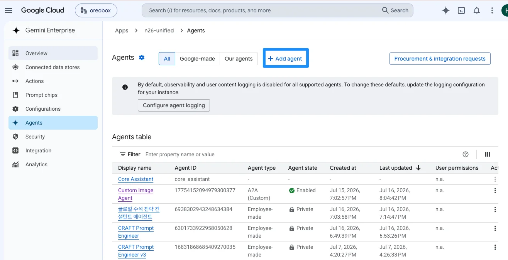

이번 예시에서는 A2A Agent Card를 이용하여 등록하겠습니다.
`Custom agent via A2A`를 클릭합니다.

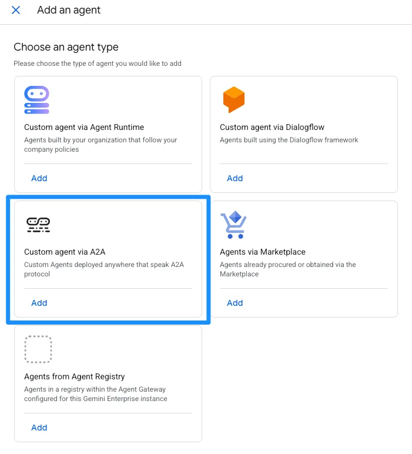

등록할 에이전트의 카드 정보를 기입하고 Preview Agent Details를 클릭합니다.

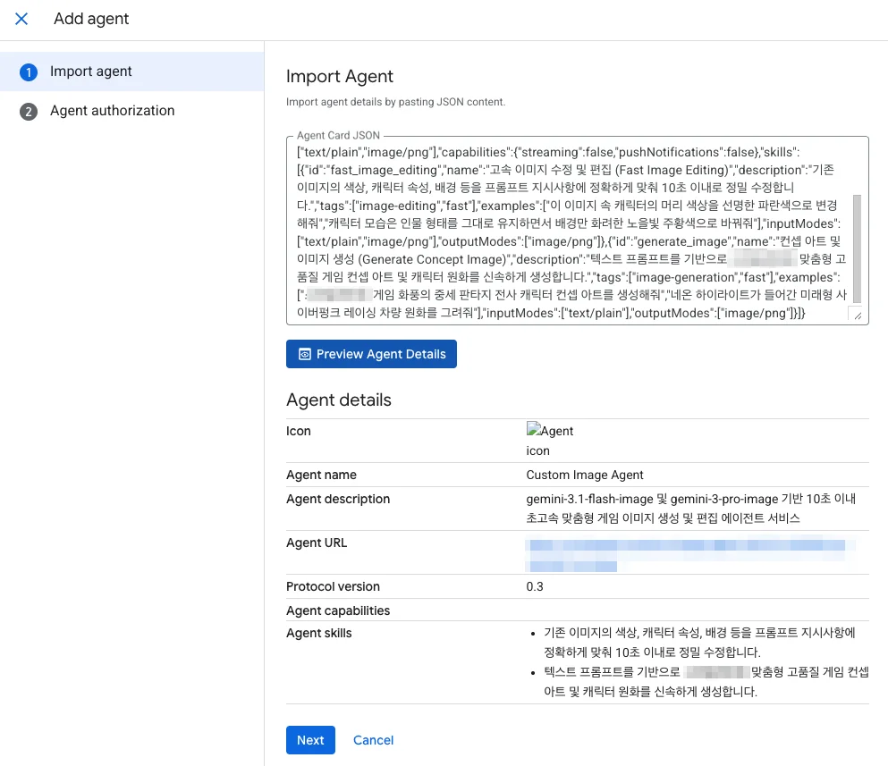


Custom Image Agent가 등록되었습니다. 프롬프트를 입력하여 이미지를 실행해봅니다.

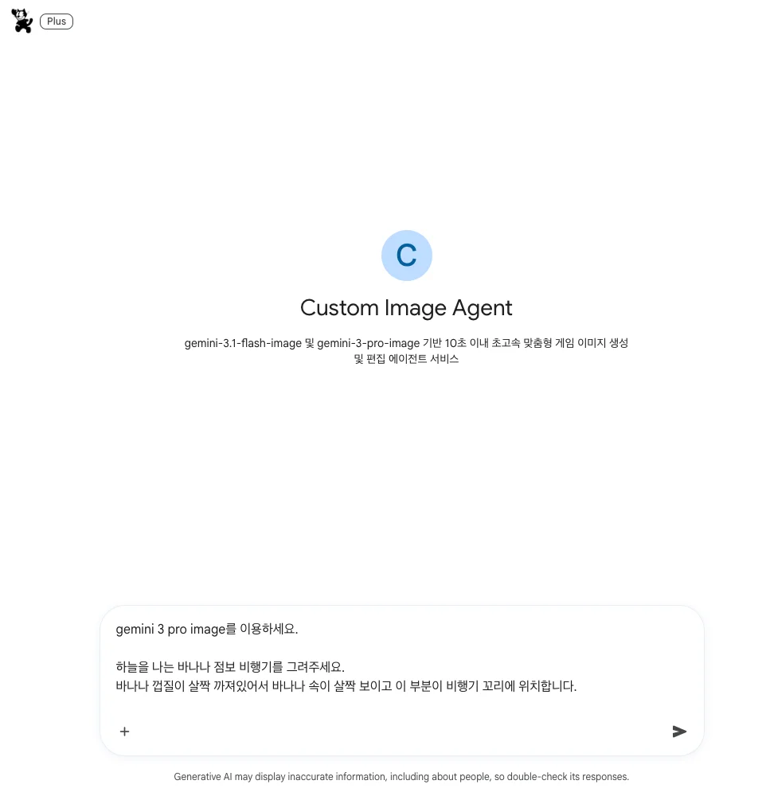

실행 결과를 볼 수 있습니다.

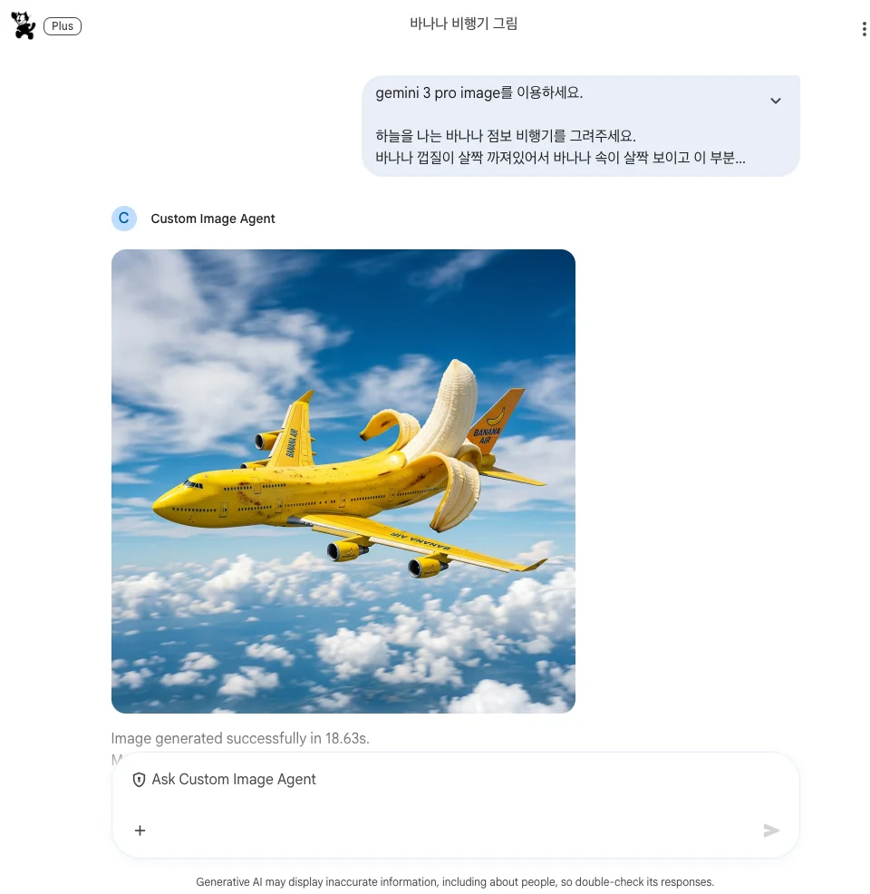

