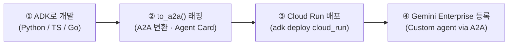

# 🟣 Track 3. Connector & Custom Agent — Pro Code

> [!NOTE]
> **트랙 개요**: Google Drive / Workspace 커넥터 연동과 Python 기반 커스텀 에이전트 개발을 다루는 심화 실습 과정입니다. 관리자가 사전에 커넥터 또는 커스텀 에이전트 환경을 구성한 상태에서 진행합니다.
> - **Part A**: Google Drive / Workspace 커넥터 활성화 및 사내 지식 RAG
> - **Part B**: Cloud Run 기반 커스텀 에이전트 배포 및 Gemini Enterprise 등록

> [!TIP]
> **실습 첨부파일 다운로드**
> - [📕 임직원 복리후생 가이드라인 (PDF)](samples/%5B공통_내규%5D_넥스트_테크놀로지스_임직원_복리후생_가이드라인.pdf) | [📄 Markdown 버전](samples/%5B공통_내규%5D_넥스트_테크놀로지스_임직원_복리후생_가이드라인.md)
> - [📕 브랜드 앰버서더 프로그램 가이드라인 (PDF)](samples/%5B마케팅_캠페인%5D_넥스트_테크놀로지스_사내_브랜드_앰버서더_프로그램_가이드라인.pdf) | [📄 Markdown 버전](samples/%5B마케팅_캠페인%5D_넥스트_테크놀로지스_사내_브랜드_앰버서더_프로그램_가이드라인.md)
> - [📄 사내 AI 윤리 및 보안 규정 (Markdown)](samples/track2_rag_policy.md)
> - [🌐 Track 3 인터랙티브 웹 포털 열기](https://geap.dev/track3.html)
> - [📽️ Track 3 16:9 발표 슬라이드 열기](https://geap.dev/slide_track3_v2.html)

---

## Part A. Connector 실습

### A.1. Google Drive & Workspace 권한 승인

구글 드라이브, 캘린더, Gmail 등을 연동해 사내 문서 검색이나 요약, 일정 관리를 자동화하려면 먼저 사용자 권한 승인이 필요합니다. 실습 중 연동 권한을 요구하는 팝업이 나타나면 제공받은 구글 계정으로 로그인하여 승인을 완료합니다.

> [!NOTE]
> Drive 커넥터 연동은 관리자가 조직 단위로 활성화한 경우에만 사용할 수 있습니다. 커넥터 목록이 보이지 않거나 **Enable actions** 버튼이 없다면 관리자에게 문의하세요.

#### 권한 승인 절차
1. 대화창 오른쪽의 **커넥터 아이콘**을 클릭해 커넥터 목록을 열고, **Drive** 항목의 **Enable actions** 버튼을 클릭합니다.

   | 커넥터 목록 열기 | 구글 계정 선택 |
   | :---: | :---: |
   |  |  |

2. 권한 요청 화면에서 Drive 파일 접근 권한을 확인하고 **Allow**를 클릭합니다.

   | OAuth 권한 동의 | Drive 연동 완료 |
   | :---: | :---: |
   |  |  |

3. Drive 항목이 **Disable actions** 버튼으로 바뀌면 Google Drive 연동이 완료된 것입니다.

> [!TIP]
> **OAuth 팝업 차단 트러블슈팅**: 연동 중 계정 선택 팝업이 나타나지 않고 무한 로딩이 걸릴 때는, 브라우저 주소창 오른쪽 끝의 **팝업 차단 아이콘**을 클릭해 **'항상 허용'**으로 변경한 뒤 페이지를 새로고침합니다.

---

### A.2. 사내 정보 검색 및 클라우드 지식 RAG 탐색

사내 드라이브나 클라우드 스토리지(GCS)에 업로드한 문서를 기반으로 정확한 출처와 함께 답변을 도출합니다.

#### 실습 준비
실습용 문서를 다운로드한 후, 구글 드라이브(또는 지정된 GCS 버킷)에 업로드합니다.
- [📕 임직원 복리후생 가이드라인.pdf](samples/%5B공통_내규%5D_넥스트_테크놀로지스_임직원_복리후생_가이드라인.pdf)
- [📕 브랜드 앰버서더 가이드라인.pdf](samples/%5B마케팅_캠페인%5D_넥스트_테크놀로지스_사내_브랜드_앰버서더_프로그램_가이드라인.pdf)
- [📄 AI 윤리 및 보안 규정.md](samples/track2_rag_policy.md)

---

#### 1) 내부 규정 RAG 검색 (Google Drive)

대화창 하단의 커넥터 설정에서 **Google Search는 OFF**, **Google Drive는 ON**으로 설정하고 질문을 실행합니다.

```markdown
내 드라이브에 있는 "복리후생" 문서를 기반으로 자녀 학자금 지원 한도가 재직 기간에 따라 어떻게 다른지 알려줘
```

| 커넥터 질문 입력 | 커넥터 승인 팝업 |
| :---: | :---: |
|  |  |

| 검색된 복지 정책 문서 | 출처 원본 파일 확인 |
| :---: | :---: |
|  |  |

---

#### 2) GCS 사설 데이터베이스 RAG 검색

Vertex AI Search 데이터스토어와 연결된 GCS 버킷 내 마케팅 캠페인 및 행사 일정 데이터를 검색합니다.

> [!IMPORTANT]
> **GCS 사전 환경 설정**: GCP 프로젝트 내 GCS 버킷, Vertex AI Search 데이터스토어, 그리고 `roles/discoveryengine.viewer` 권한이 사전에 설정되어 있어야 합니다. 환경이 준비되지 않은 경우 동일 파일을 Google Drive에 업로드하여 실습할 수 있습니다.

```markdown
넥스트 테크놀로지스의 사내 브랜드 앰버서더 참여 요건과 전용 VIP 혜택이 무엇인지 요약해줘
```

| GCS 실시간 질의 결과 | 답변 출처 목록 확인 |
| :---: | :---: |
|  |  |

```markdown
넥스트월드 토크콘서트 개최 일정, 시간, 대강당 위치, 그리고 초청 강사를 정확히 가이드해줘
```


> [!TIP]
> **RAG-Ready: 검색 정확도를 높이는 문서 작성 3대 원칙**
> 1. **시각 자료의 텍스트 병기**: 차트, 다이어그램 내 수치는 하단에 텍스트 요약이나 표(Table)를 함께 작성합니다.
> 2. **명확한 헤딩(Heading) 계층화**: H1, H2, H3 스타일을 명확히 구분하여 문서를 작성하면 시맨틱 검색 정확도가 상승합니다.
> 3. **버전 관리 및 최신본 동기화**: 구버전 문서는 아카이브 폴더로 이관하여 LLM이 최신 문서만 참조하도록 관리합니다.

---

## Part B. Custom Agent 개발

### B.1. 커스텀 에이전트 및 ADK / CAA 개발

Python 코드로 에이전트를 개발하여 Cloud Run에 배포하고, A2A(Agent-to-Agent) 프로토콜을 통해 Gemini Enterprise에 등록하는 전체 라이프사이클을 이해합니다.



#### 개발 및 배포 파이프라인

**① + ② ADK 에이전트 작성 & to_a2a() 래핑**
[ADK(Agent Development Kit)](https://adk.dev/)를 사용해 Python 에이전트를 작성하고 `to_a2a()` 함수로 A2A 프로토콜 호환 서버로 변환합니다. `to_a2a()`는 Agent Card JSON을 자동 생성합니다.

```python
from google.adk.agents import Agent
from google.adk.a2a.utils import to_a2a

def my_tool(query: str) -> str:
    # 비즈니스 로직 구현
    return result

root_agent = Agent(
    model='gemini-2.5-flash',
    name='my_agent',
    description='업무 자동화 에이전트',
    tools=[my_tool],
)

# A2A 서버 변환 + Agent Card 자동 생성
app = to_a2a(root_agent)
```

**③ Cloud Run 배포**
```bash
adk deploy cloud_run \
  --service_name=my-agent \
  --project $PROJECT \
  --region $REGION \
  --a2a my_agent/
```

배포가 완료되면 Agent Card가 `<Cloud Run URL>/a2a/.well-known/agent-card.json` 경로에 자동 게시됩니다.

---

#### ④ Gemini Enterprise 등록 (어드민)

Google Cloud 콘솔 **Agents > Add agent**에서 A2A Agent Card를 등록합니다.

| Add agent 클릭 | Custom agent via A2A 선택 |
| :---: | :---: |
|  |  |

| 에이전트 카드 JSON 입력 | 등록 완료 및 대화 인터페이스 |
| :---: | :---: |
|  |  |

| 이미지 생성 결과 화면 | 최종 생성 이미지 확인 |
| :---: | :---: |
|  |  |
