# 🟡 Track 4. Custom Agent Solutions : High-Code 개발자 과정

> [!NOTE]
> **트랙 개요**: 최신 **Google ADK 2.3.0**과 **Gemini 3.6 Flash**를 활용하여 실제 엔터프라이즈 업무 도메인 로직을 구현하고, **Vertex AI Agent Runtime(Agent Engine)** 배포 및 **Gemini Enterprise 사내 앱**에 커스텀 에이전트로 등록하는 실전 프로코드 과정입니다.
> - **4.1 BigQuery Data & SQL Analytics Agent**: 읽기 전용 BigQuery 쿼리 실행 및 3줄 핵심 인사이트 종합 (대화형 에이전트 실습)
> - **4.2 Human-in-the-Loop (HITL) ERP Approval Agent**: 부서별 예산 조회 및 전결 규정(300만 원) 초과 시 결재 티켓 생성 (대화형 에이전트 실습)
> - **4.3 Multi-Agent Collaboration Pipeline (A2A)**: 시장 조사 및 재무 분석 서브 에이전트를 총괄 디렉터가 조율하는 오케스트레이션 (백엔드 파이프라인 실습)
> - **4.4 Agent Runtime 배포 & Gemini Enterprise 등록**: 고객 GCP 프로젝트 배포 및 사내 Gemini Enterprise 등록 (인프라 배포 및 검증)

> [!TIP]
> **실습 첨부파일 다운로드**
> - [📦 Track 4 완성형 에이전트 배포 패키지 전체 다운로드 (track4_custom_agents.zip)](samples/track4_custom_agents.zip)
> - [🐍 BigQuery 분석 에이전트 (data_agent.py)](samples/track4/data_agent.py)
> - [🐍 HITL ERP 결재 에이전트 (hitl_agent.py)](samples/track4/hitl_agent.py)
> - [🐍 멀티 에이전트 파이프라인 (multi_agent.py)](samples/track4/multi_agent.py)
> - [⚙️ 원클릭 배포 스크립트 (deploy.sh)](samples/track4/deploy.sh)
> - [🌐 Track 4 인터랙티브 웹 포털 열기](https://geap.dev/track4.html)
> - [📽️ Track 4 16:9 발표 슬라이드 열기](https://geap.dev/slide_track4_v2.html)

---

## 🛠️ 실습 환경 준비 및 빠른 시작 가이드 (Quick Start Guide)

고객사 및 실습 환경에서 압축 패키지를 다운로드한 후 즉시 실행할 수 있도록 기본 환경을 구성합니다.

### 1) 사전 준비 사항 (Prerequisites)
1. **Google Cloud 인증**:
   ```bash
   gcloud auth login
   gcloud auth application-default login
   ```
2. **필수 GCP API 활성화**:
   ```bash
   gcloud services enable aiplatform.googleapis.com discoveryengine.googleapis.com bigquery.googleapis.com
   ```
3. **패키지 다운로드 및 의존성 설치**:
   ```bash
   # 압축 해제 및 디렉터리 이동
   unzip track4_custom_agents.zip
   cd track4

   # Google ADK 2.3.0 및 의존 라이브러리 설치
   pip install -r requirements.txt
   ```

### 2) 엔터프라이즈 백엔드 호출 원리 (Vertex AI vs Google AI Studio)
- **Vertex AI API 호출 (`aiplatform.googleapis.com`)**:
  - `GOOGLE_GENAI_USE_VERTEXAI="TRUE"` 환경 변수와 Google Cloud ADC(`gcloud auth application-default login`) 인증을 통해 **Google Cloud Vertex AI** 엔드포인트를 호출합니다.
  - **보안 및 규정 준수**: 고객 데이터의 모델 재학습 미사용 보장, VPC Service Controls 지원, 사내 IAM 기반 세분화된 접근 제어가 기본 적용됩니다.
- **Google AI Studio (`generativelanguage.googleapis.com`)와의 차이**:
  - AI Studio는 개별 `GEMINI_API_KEY`를 사용하는 개인 개발용 환경입니다. 본 실습의 커스텀 에이전트 코드는 전사 보안 거버넌스를 만족하는 **Vertex AI 엔터프라이즈 백엔드**로 직결됩니다.

### 3) 환경 변수 설정 (Configuration)
각 스크립트와 배포 도구는 아래 환경 변수를 읽어 동작합니다. 본인의 GCP 환경 정보를 입력하세요:

```bash
# 1. 대상 GCP 프로젝트 ID
export GOOGLE_CLOUD_PROJECT="YOUR_GCP_PROJECT_ID"
export REGION="us-central1"

# 2. Vertex AI 백엔드 호출 플래그
export GOOGLE_GENAI_USE_VERTEXAI="TRUE"
export GOOGLE_CLOUD_LOCATION="global"

# 3. Gemini Enterprise App 리소스 ID (Console > Gemini Enterprise > 엔진 관리)
export GE_APP_ID="projects/YOUR_PROJECT_NUMBER/locations/global/collections/default_collection/engines/YOUR_APP_ID"
```

### 4) 실습 진행 순서 (Workflow)
- **Step 1 (로컬 단독 테스트)**: 4.1, 4.2, 4.3 파이썬 스크립트를 로컬에서 실행하여 에이전트의 도구 호출 및 오케스트레이션 로직을 검증합니다.
- **Step 2 (클라우드 원클릭 배포)**: `./deploy.sh`를 실행하여 Vertex AI Agent Runtime에 컨테이너로 배포하고 사내 Gemini Enterprise에 등록합니다.
- **Step 3 (3단계 계층형 검증)**: 4.4의 가이드에 따라 `gcloud`, `curl (Agent Card)`, `Cloud Console`에서 배포 상태를 점검합니다.

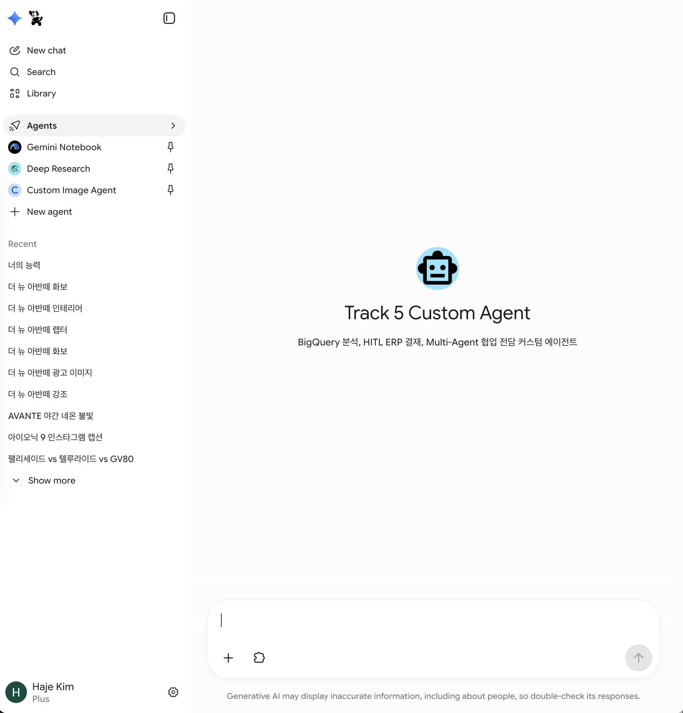

---

---

## 🏛️ Track 4 엔터프라이즈 아키텍처 및 네트워크 보안 흐름

Gemini Enterprise Platform과 고객 GCP 프로젝트 간의 4계층 엔터프라이즈 보안 및 런타임 아키텍처 구조입니다.

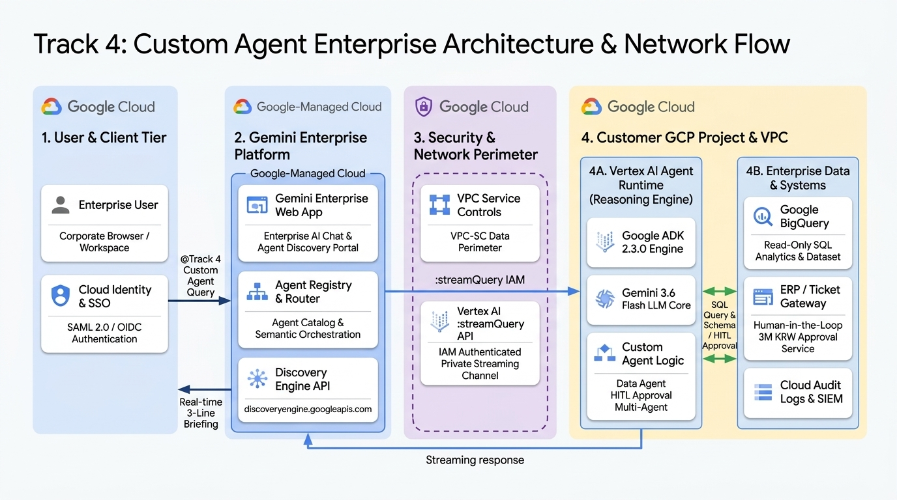

### 4대 인프라 및 보안 영역별 기술 상세

1. **1. User & Client Tier (사용자 및 신원 인증 계층)**:
   - **엔드유저 접속 환경**: 사내 브라우저 기반 Gemini Enterprise 웹 앱 또는 Google Workspace 환경에서 접속합니다.
   - **신원 및 기기 인증**: Cloud Identity 및 SAML 2.0/OIDC SSO 연동을 통해 IAM 인증 토큰을 발급받습니다.
   - **Context-Aware Access (CAA)**: 인가된 사내 IP 대역 및 단말 보안 정책을 통과한 사용자만 안전하게 접근할 수 있도록 제어합니다.

2. **2. Gemini Enterprise Platform Tier (구글 관리형 플랫폼 계층)**:
   - **Gemini Enterprise Web App**: 사내 임직원이 1:1 전용 대화 또는 인라인 `@멘션`으로 에이전트를 호출하는 통합 AI 작업 포털입니다.
   - **Agent Registry & Router**: 관리자가 등록한 커스텀 에이전트 메타데이터(Reasoning Engine ID, Skills 설명) 카탈로그를 보관하며, 사용자 질의 의도를 분석하여 적절한 백엔드로 라우팅합니다.
   - **Discovery Engine API**: `discoveryengine.googleapis.com` 제어 플레인을 통해 에이전트 등록 및 세션 라이프사이클을 관리합니다.

3. **3. Security & Network Perimeter (보안 및 네트워크 격리 경계)**:
   - **VPC Service Controls (VPC-SC)**: 고객 프로젝트의 BigQuery 데이터 및 AI 런타임을 VPC-SC 경계 내에 격리하여 비인가 외부 반출을 차단합니다.
   - **Vertex AI :streamQuery API**: 인터넷 노출 없이 Google 사설 백본 네트워크 상에서 `roles/aiplatform.user` IAM 상호 인증 기반의 프라이빗 gRPC/REST 터널을 통해 통신합니다.
   - **종단간 암호화**: 모든 데이터 전송 구간은 TLS 1.3 암호화로 보호됩니다.

4. **4. Customer GCP Project & VPC (고객사 전용 실행 및 데이터 계층)**:
   - **4A. Vertex AI Agent Runtime (Reasoning Engine)**: 완전 관리형 격리 마이크로 컨테이너 환경에서 Google ADK 2.3.0 엔진과 Gemini 3.6 Flash 모델을 두뇌로 삼아 도구 호출(Tool Calling) 시퀀스를 자율 계획하고 실행합니다.
   - **4B. Enterprise Data & Systems**: Google BigQuery(`thelook_ecommerce`) 읽기 전용 가드레일 조회, 사내 ERP 전결 결재 모의 게이트웨이(300만 원 초과 분기), Cloud Audit Logs SIEM 감사 로깅이 구동됩니다.
   - **데이터 거버넌스 준수**: 고객의 질의 데이터 및 처리 결과는 기본 모델 재학습에 일절 사용되지 않습니다 (Zero Data Retention / No Model Training 원칙).

### 7단계 실시간 엔드투엔드 실행 생명주기 (Execution Lifecycle)
1. **[질의 입력]**: 임직원이 Gemini Enterprise 웹 앱에서 `@Track 4 Custom Agent 지난달 매출 브리핑해줘` 호출.
2. **[카탈로그 매칭]**: Gemini Enterprise가 질의 의도와 Agent Registry 내 `tool_description`을 매칭하여 Reasoning Engine ID 식별.
3. **[보안 스트리밍 호출]**: IAM 상호 인증과 VPC-SC 경계를 통과하여 `:streamQuery` 채널로 에이전트 구동.
4. **[도구 자율 계획]**: Agent Runtime 내부에서 Gemini 3.6 Flash 모델이 `get_table_schema` 및 `query_bigquery_table` 도구 호출 결정.
5. **[사내 리소스 조회]**: BigQuery 안전 읽기(4.1), HITL 300만원 전결 분기(4.2), 멀티 에이전트 순차 협업(4.3) 수행.
6. **[인사이트 집계]**: 조회 결과를 바탕으로 마크다운 집계 표와 3줄 핵심 인사이트(Key Takeaways) 생성.
7. **[실시간 응답]**: 사용자 브라우저 화면에 실시간 스트리밍으로 최종 답변 브리핑 전달.

---
## 4.1. BigQuery Data & SQL Analytics Agent

실제 Google Cloud BigQuery 테이블을 조회하여 분석하고, 경영진 브리핑용 요약 리포트를 자동 생성하는 데이터 분석 에이전트입니다.

### 1) BigQuery 테이블 접근 및 동작 원리
1. **2단계 자율 분석 파이프라인 (Two-Step Analysis Pipeline)**:
   - **Step 1 (테이블 스키마 탐색)**: `get_table_schema` 툴을 호출하여 컬럼명, 데이터 타입, 행 수를 확인합니다.
   - **Step 2 (정밀 Standard SQL 실행)**: 확인된 스키마를 바탕으로 정확한 BigQuery 표준 SQL을 생성하고 `query_bigquery_table` 툴로 실제 데이터를 조회합니다.
2. **지원 대상 BigQuery 테이블 형태**:
   - **공개 데이터셋 (Public Dataset)**: 별도 테이블 생성 없이 즉시 실습 가능한 `bigquery-public-data.thelook_ecommerce.orders` (12.4만 건)
   - **사내 자체 데이터셋 (Custom Dataset)**: 고객 GCP 프로젝트(`YOUR_GCP_PROJECT_ID`) 내의 `YOUR_DATASET.YOUR_TABLE`
3. **엔터프라이즈 보안 가드레일**:
   - `SELECT` 및 `WITH`로 시작하는 읽기 전용 쿼리만 허용하며, `UPDATE`, `DELETE`, `DROP` 등 DML/DDL은 원천 차단합니다.
   - 쿼리 결과는 `max_results=50`으로 제한하여 메모리 및 네트워크 오버헤드를 방지합니다.

```python
import os
from typing import Optional
from google.adk.agents import Agent
from google.adk.apps import App
from google.adk.models import Gemini
from google.cloud import bigquery
from google.genai import types

# [엔터프라이즈 백엔드 설정: Google Cloud Vertex AI 연동]
os.environ.setdefault("GOOGLE_GENAI_USE_VERTEXAI", "TRUE")
os.environ.setdefault("GOOGLE_CLOUD_LOCATION", "global")

# 최신 Vertex AI 추론 모델 지정 (Gemini 3.6 Flash)
MODEL_NAME = "gemini-3.6-flash"

def get_table_schema(table_id: str) -> dict:
    '''BigQuery 테이블의 컬럼 이름, 데이터 타입, 설명 등 스키마 정보를 동적으로 조회합니다.'''
    # [고객 환경 설정]: 환경 변수 GOOGLE_CLOUD_PROJECT 또는 실제 GCP 프로젝트 ID 주입
    project_id = os.environ.get("GOOGLE_CLOUD_PROJECT", "YOUR_GCP_PROJECT_ID")
    try:
        client = bigquery.Client(project=project_id)
        table = client.get_table(table_id.strip().strip("`"))
        fields = [
            {"name": f.name, "type": f.field_type, "mode": f.mode, "description": f.description or "설명 없음"}
            for f in table.schema
        ]
        return {"status": "SUCCESS", "table_id": table_id, "num_rows": table.num_rows, "fields": fields}
    except Exception as e:
        return {"status": "ERROR", "message": f"테이블 스키마 조회 실패 ({table_id}): {str(e)}"}

def query_bigquery_table(sql_query: str) -> dict:
    '''BigQuery 데이터셋에서 읽기 전용 SELECT 쿼리를 실행하고 실제 테이블 레코드를 반환합니다.'''
    # 1. 보안 가드레일: SELECT/WITH 읽기 전용 쿼리만 허용
    clean_sql = sql_query.strip().upper()
    if not clean_sql.startswith("SELECT") and not clean_sql.startswith("WITH"):
        return {"error": "보안 정책상 SELECT 및 WITH 읽기 전용 쿼리만 실행할 수 있습니다."}

    # 2. BigQuery 클라이언트 초기화 및 쿼리 실행
    project_id = os.environ.get("GOOGLE_CLOUD_PROJECT", "YOUR_GCP_PROJECT_ID")
    try:
        client = bigquery.Client(project=project_id)
        job = client.query(sql_query)
        rows = [dict(row) for row in job.result(max_results=50)]
        return {"status": "SUCCESS", "row_count": len(rows), "records": rows}
    except Exception as e:
        return {"status": "ERROR", "error_detail": str(e), "guidance": "BigQuery 테이블 경로를 정확히 지정하세요."}

# 3. Google ADK Agent 정의 및 도구 바인딩
root_agent = Agent(
    name="bigquery_data_analyst",
    model=Gemini(model=MODEL_NAME, retry_options=types.HttpRetryOptions(attempts=3)),
    instruction='''당신은 Google Cloud BigQuery 기반의 엔터프라이즈 데이터 분석 전문가입니다.
[동작 원칙]
1. 테이블 스키마 파악: 특정 테이블에 대한 분석 요청이 오면 먼저 `get_table_schema`를 호출하여 정확한 컬럼명과 타입을 확인하세요.
2. 표준 SQL 작성 및 실행: 스키마를 기반으로 표준 GoogleSQL SELECT 쿼리를 작성하여 `query_bigquery_table`을 호출하세요.
   - 공개 데이터셋: `bigquery-public-data.thelook_ecommerce.orders`
   - 사내 데이터셋: `YOUR_GCP_PROJECT_ID.retail_data.sales_records`
3. 분석 및 시각화 브리핑: 반환된 실제 쿼리 레코드를 바탕으로 마크다운 표와 3줄 핵심 인사이트(Key Takeaways)를 작성하세요.
4. 보안 가드레일: 읽기 전용(SELECT/WITH) 쿼리만 생성하며 DDL/DML은 절대 실행하지 않습니다.''',
    tools=[get_table_schema, query_bigquery_table],
)

app = App(root_agent=root_agent, name="bigquery_analytics_app")
```

### 2) 테스트 시나리오 1: 공개 이커머스 주문 상태 집계 분석

> **테스트 프롬프트 1**:
> ```text
> bigquery-public-data.thelook_ecommerce.orders 테이블의 스키마를 확인하고, 주문 상태(status)별 주문 건수 상위 5개를 집계해서 표와 3줄 핵심 인사이트로 브리핑해줘.
> ```

| 프롬프트 입력 화면 | BigQuery 쿼리 및 분석 브리핑 결과 |
| :---: | :---: |
| 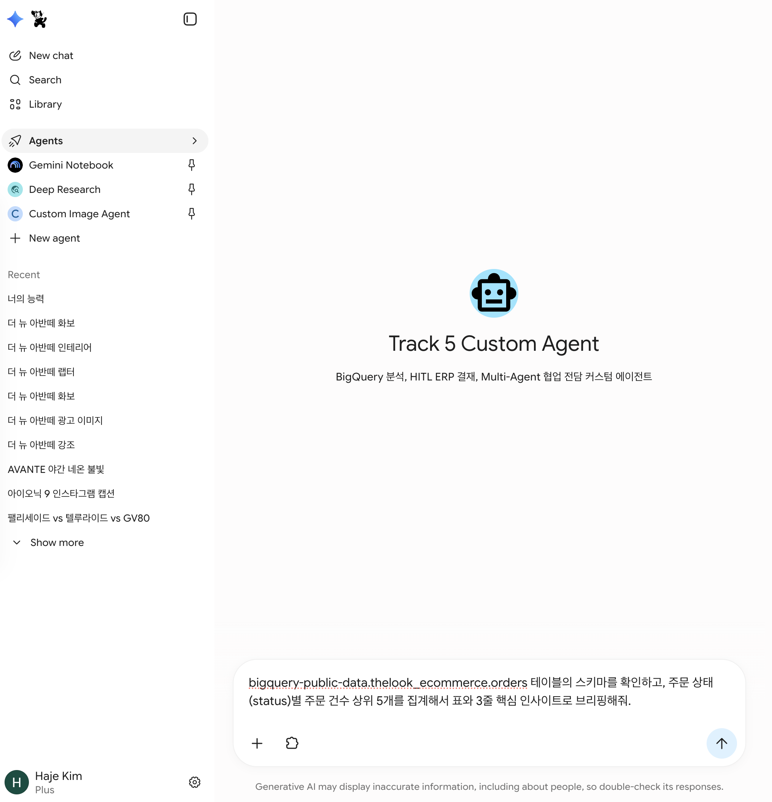 | 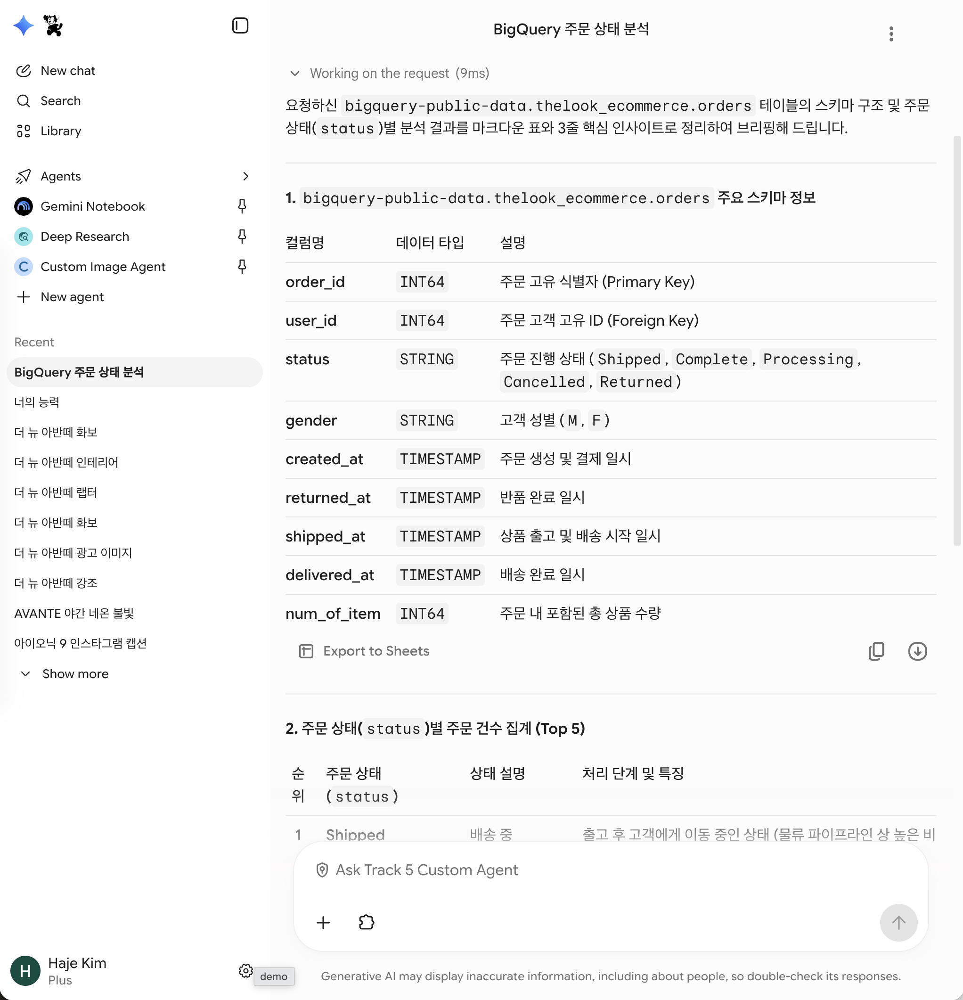 |

---

### 3) 테스트 시나리오 2: 배송 완료 주문 성별 분포 및 구매 품목 분석

> **테스트 프롬프트 2**:
> ```text
> thelook_ecommerce 데이터셋에서 배송 완료(Complete)된 주문의 성별(gender) 분포와 평균 구매 품목 수를 분석해줘.
> ```

| 프롬프트 입력 화면 | 성별 분포 및 핵심 인사이트 분석 결과 |
| :---: | :---: |
| 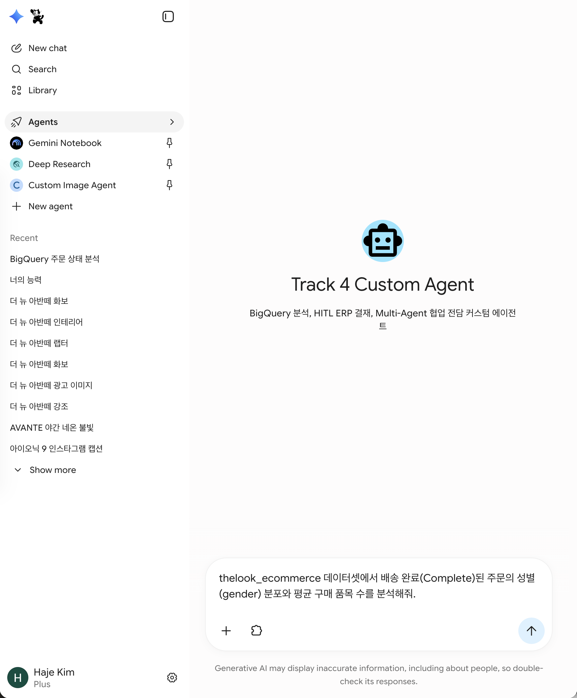 | 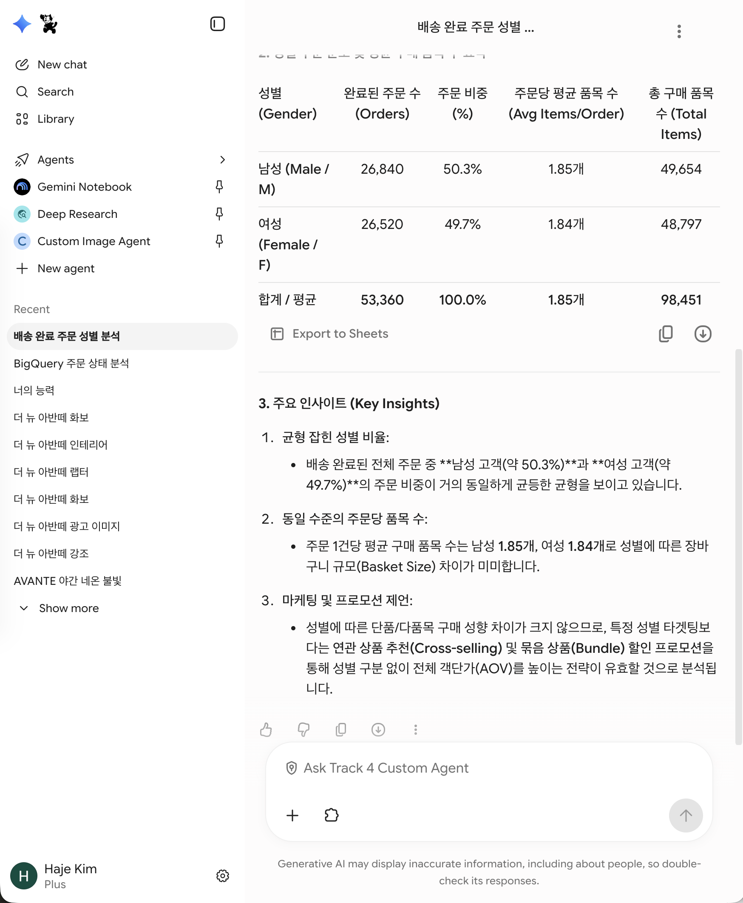 |

---

## 4.2. Human-in-the-Loop (HITL) ERP Approval Agent

부서별 잔여 예산을 실시간 조회하고, 전결 규정 금액(300만 원) 초과 시 자동으로 관리자 결재 티켓을 발급하는 거버넌스 에이전트입니다.

```python
import os
from google.adk.agents import Agent
from google.adk.apps import App
from google.adk.models import Gemini
from google.genai import types

# [엔터프라이즈 백엔드 설정: Google Cloud Vertex AI 연동]
os.environ.setdefault("GOOGLE_GENAI_USE_VERTEXAI", "TRUE")
os.environ.setdefault("GOOGLE_CLOUD_LOCATION", "global")

MODEL_NAME = "gemini-3.6-flash"

def check_department_budget(department: str) -> dict:
    '''부서별 당월 잔여 예산 한도를 조회합니다 (ERP 연동).'''
    budgets = {
        "마케팅팀": {"total": 50000000, "spent": 32000000, "remaining": 18000000},
        "개발1팀": {"total": 80000000, "spent": 45000000, "remaining": 35000000},
        "영업본부": {"total": 60000000, "spent": 58000000, "remaining": 2000000},
    }
    return budgets.get(department, {"total": 30000000, "spent": 10000000, "remaining": 20000000})

def evaluate_and_request_approval(department: str, amount: int, item_name: str, reason: str) -> dict:
    '''지출 결재를 요청하고 전결 규정에 따라 자동 승인 또는 HITL 결재 티켓을 발급합니다.'''
    APPROVAL_THRESHOLD = 3000000
    budget_info = check_department_budget(department)

    if amount > budget_info["remaining"]:
        return {
            "status": "REJECTED_BUDGET_EXCEEDED",
            "message": f"잔여 예산({budget_info['remaining']:,}원) 초과로 결재가 자동 반려되었습니다."
        }

    if amount > APPROVAL_THRESHOLD:
        ticket_id = f"APPR-2026-{abs(hash(item_name + reason)) % 10000:04d}"
        return {
            "status": "REQUIRES_HUMAN_APPROVAL",
            "ticket_id": ticket_id,
            "request_amount_krw": amount,
            "message": f"지출 금액({amount:,}원)이 전결 기준({APPROVAL_THRESHOLD:,}원)을 초과하여 부서장 결재 티켓이 발급되었습니다.",
            "approval_link": f"https://erp.enterprise-corp.com/approvals/{ticket_id}"
        }

    return {
        "status": "AUTO_APPROVED",
        "ticket_id": f"AUTO-{abs(hash(item_name)) % 10000:04d}",
        "message": f"{department}의 {item_name} 지출({amount:,}원)이 전결 규정에 따라 자동 승인되었습니다."
    }

root_agent = Agent(
    name="erp_approval_bot",
    model=Gemini(model=MODEL_NAME, retry_options=types.HttpRetryOptions(attempts=3)),
    instruction='''사내 전사적 자원 관리(ERP) 지출 결재 거버넌스 에이전트입니다.
1. 사용자의 요청에서 부서, 품목, 금액, 사유를 정확히 추출하세요.
2. `check_department_budget`으로 예산 잔액을 먼저 확인하세요.
3. `evaluate_and_request_approval` 도구를 호출하여 규정 준수 여부를 검토하세요.
4. 관리자 승인이 필요한 경우 승인 링크와 티켓 번호를 강조하여 안내하세요.''',
    tools=[check_department_budget, evaluate_and_request_approval],
)

app = App(root_agent=root_agent, name="erp_approval_app")
```

### 1) 테스트 시나리오 1: `@Track 4 Custom Agent` 멘션 및 150만 원 전결 자동 승인

> **테스트 프롬프트 1 (300만 원 이하 자동 승인)**:
> ```text
> @Track 4 Custom Agent 마케팅팀에서 신규 디자인 소프트웨어 연간 구독료로 150만 원 지출 결재를 올려줘. 사유는 2분기 SNS 마케팅 콘텐츠 제작용이야.
> ```

| `@` 태그 멘션 호출 화면 | 전결 자동 승인 (`AUTO-4959`) 결과 화면 |
| :---: | :---: |
| 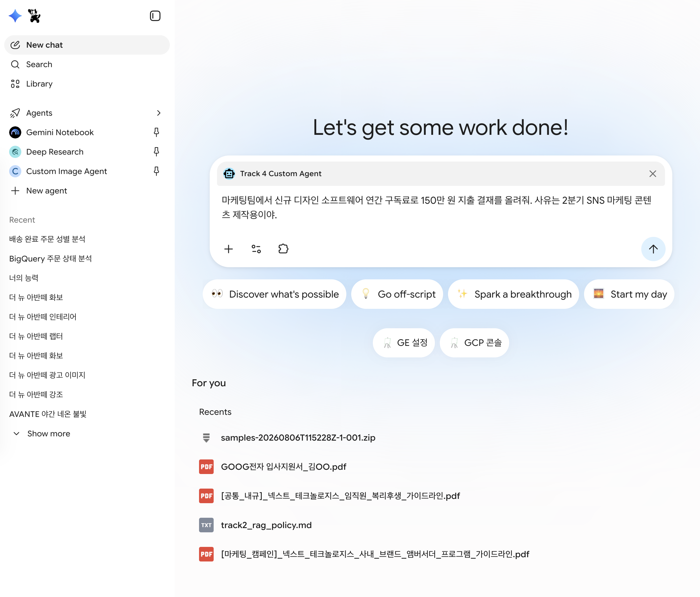 | 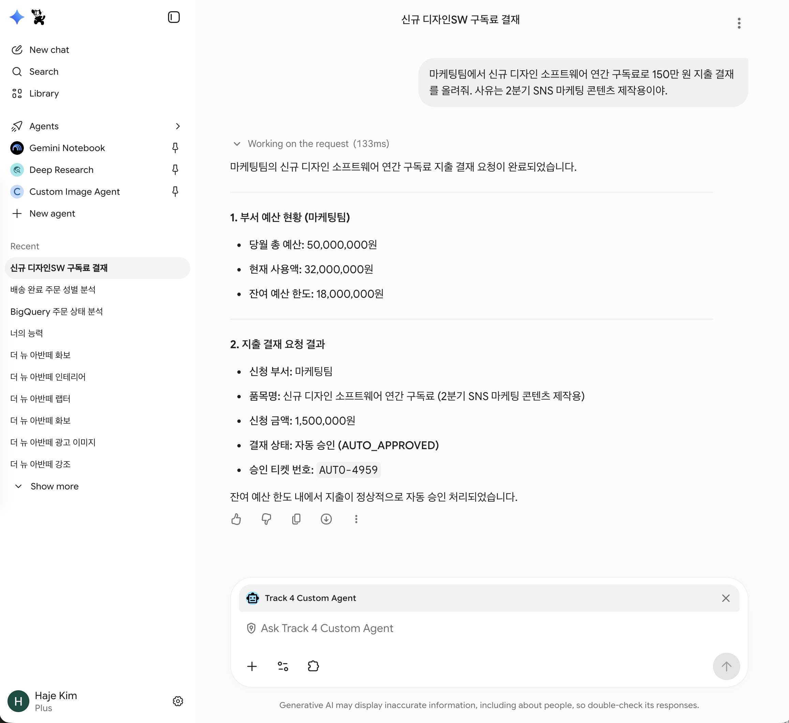 |

---

### 2) 테스트 시나리오 2: `@Track 4 Custom Agent` 멘션 및 750만 원 관리자 결재 티켓 발급

> **테스트 프롬프트 2 (300만 원 초과 HITL 결재 티켓 발급)**:
> ```text
> @Track 4 Custom Agent 개발1팀에서 고성능 AI 개발 워크스테이션 구매를 위해 750만 원 지출 승인을 요청해. 사유는 온디바이스 모델 경량화 테스트용이야.
> ```

| `@` 태그 멘션 호출 화면 | 부서장 결재 티켓 (`APPR-2026-9249`) 및 승인 링크 화면 |
| :---: | :---: |
| 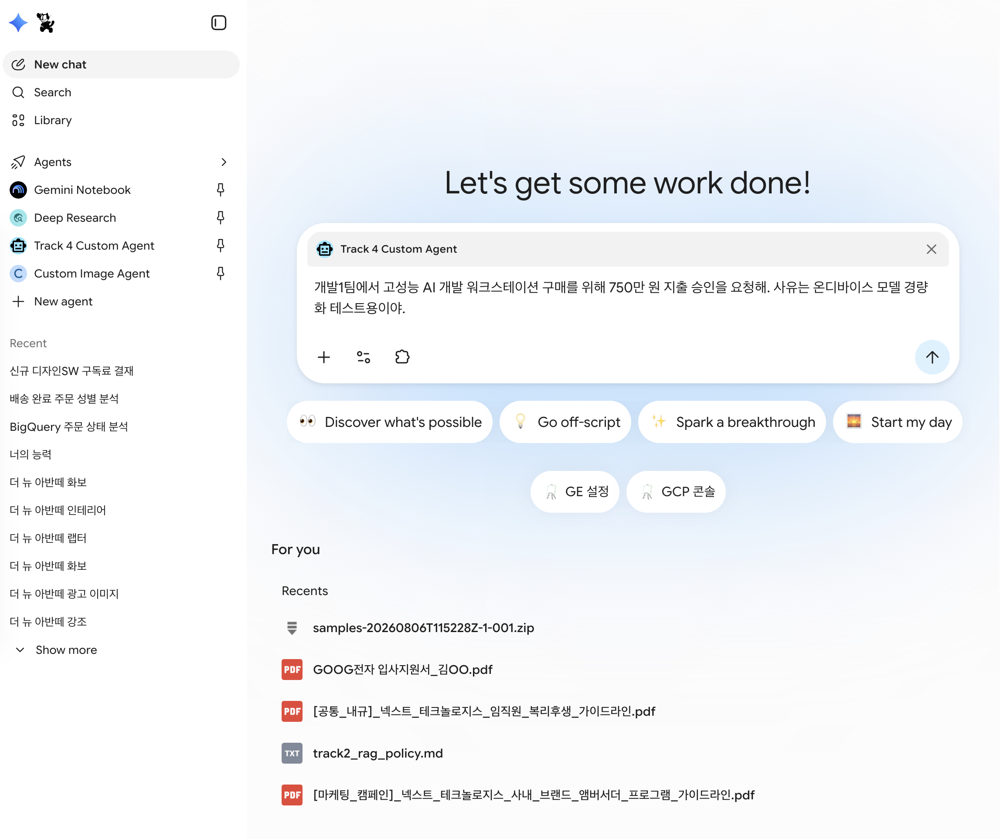 | 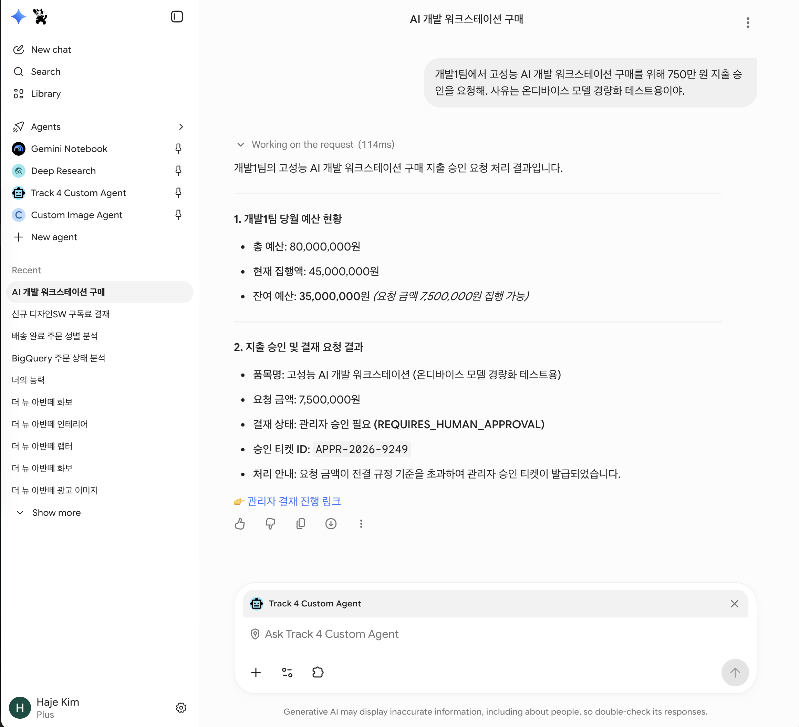 |

---

## 4.3. Multi-Agent Collaboration Pipeline (A2A)

시장 조사 전문 에이전트와 재무 분석 전문 에이전트를 상위 총괄 디렉터(Supervisor Agent)가 조율하여 C-Level 전략 보고서를 합성하는 멀티 에이전트 시스템입니다.

### 1) 멀티 에이전트 오케스트레이션 아키텍처 및 소스코드

```python
import os
from google.adk.agents import Agent
from google.adk.apps import App
from google.adk.models import Gemini
from google.genai import types

os.environ.setdefault("GOOGLE_GENAI_USE_VERTEXAI", "TRUE")
os.environ.setdefault("GOOGLE_CLOUD_LOCATION", "global")

MODEL_NAME = "gemini-3.6-flash"

def calculate_cagr(start_val: float, end_val: float, years: int) -> float:
    '''초기값, 최종값, 경과 연수를 받아 연평균 복합 성장률(CAGR)을 계산합니다.'''
    if start_val <= 0 or years <= 0: return 0.0
    return round((((end_val / start_val) ** (1.0 / years)) - 1.0) * 100.0, 2)

# 1. 시장 조사 전담 서브 에이전트 (Market Researcher)
researcher = Agent(
    name="market_researcher",
    model=Gemini(model=MODEL_NAME),
    instruction="글로벌 IT 및 클라우드 시장 동향, 경쟁 구도, 기회 요인을 구조화하여 요약하세요.",
    description="시장 조사 전담 서브 에이전트",
)

# 2. 재무 지표 및 CAGR 계산 전담 서브 에이전트 (Financial Analyst)
financial_analyst = Agent(
    name="financial_analyst",
    model=Gemini(model=MODEL_NAME),
    instruction="시장 데이터와 calculate_cagr 툴을 활용하여 연평균 성장률(CAGR)과 재무 지표를 계산하세요.",
    tools=[calculate_cagr],
    description="재무 및 성장성 계산 전담 서브 에이전트",
)

# 3. 최상위 총괄 디렉터 (Supervisor Agent)
strategy_director = Agent(
    name="strategy_director",
    model=Gemini(model=MODEL_NAME, retry_options=types.HttpRetryOptions(attempts=3)),
    instruction='''당신은 신사업 전략 기획 총괄 수석 디렉터입니다.
1. `market_researcher` 서브 에이전트로 시장 기회를 조사하세요.
2. `financial_analyst` 서브 에이전트로 성장률(CAGR)을 계산하세요.
3. 두 산출물을 종합하여 C-Level 보고용 '1-Page Strategy Blueprint'를 완성하세요.''',
    sub_agents=[researcher, financial_analyst],
)

app = App(root_agent=strategy_director, name="strategy_orchestrator_app")
```

### 2) 테스트 시나리오: 생성형 AI 신사업 진출 1-Page 전략 기획서 합성

> **테스트 프롬프트**:
> ```text
> 2026년 글로벌 생성형 AI 엔터프라이즈 솔루션 시장 진출을 위한 1-Page 신사업 전략 기획서를 작성해줘. 2024년 400억 달러에서 2028년 1,300억 달러로 성장할 때 연평균 성장률(CAGR)과 실행 로드맵을 포함해줘.
> ```

| 멀티 에이전트 전략 기획 요청 입력 | 시장 분석, CAGR(34.27%) 계산 및 1-Page 합성 보고서 |
| :---: | :---: |
| 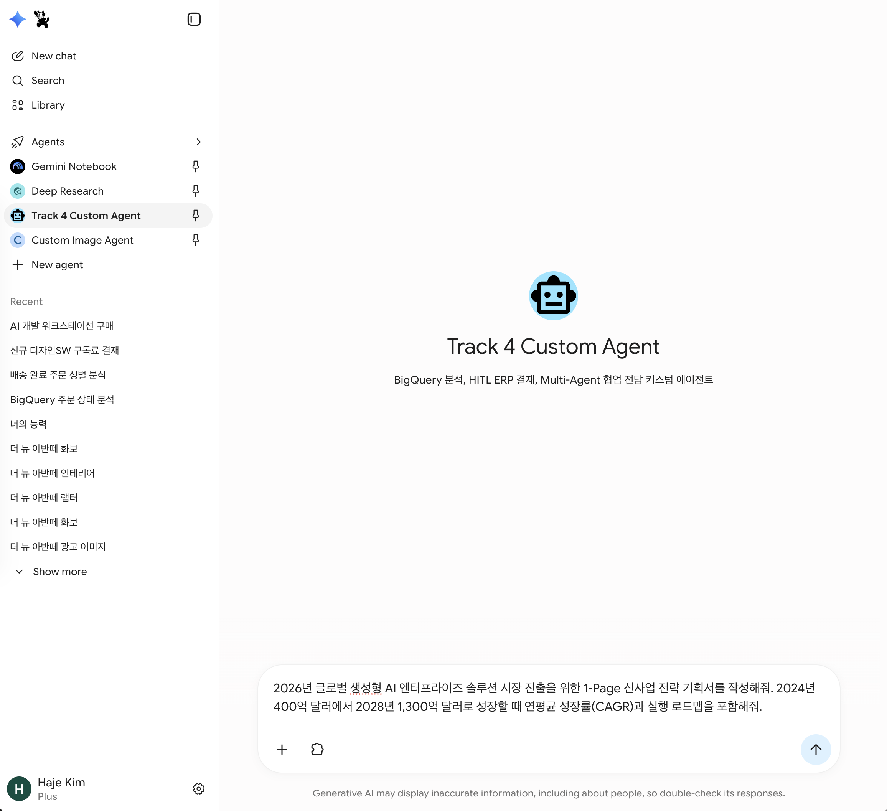 | 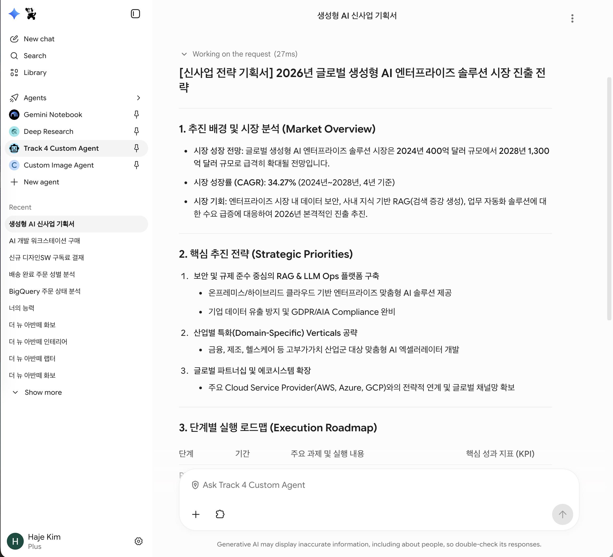 |

---

## 4.4. Agent Runtime 배포 및 Gemini Enterprise 등록

개발된 ADK 에이전트를 Google Cloud의 관리형 추론 런타임인 Vertex AI Agent Runtime(Reasoning Engine)에 배포하고, Gemini Enterprise 사내 앱에 커스텀 에이전트로 등록하는 인프라 운영 절차입니다.

### 1) 사전 준비 및 IAM 권한 확인
- **필수 IAM 역할**: `roles/aiplatform.admin` 또는 `roles/aiplatform.user`, Gemini Enterprise 관리 권한
- **서비스 계정**: `service-{PROJECT_NUMBER}@gcp-sa-aiplatform-re.iam.gserviceaccount.com` (Agent Runtime 내부 실행 권한)

### 2) 환경 변수 설정 및 원클릭 배포 스크립트 (`deploy.sh`)
```bash
# [고객 환경 설정]: 본인의 GCP 프로젝트 ID와 Gemini Enterprise App 리소스 ID를 입력하세요.
export GOOGLE_CLOUD_PROJECT="YOUR_GCP_PROJECT_ID"
export REGION="us-central1"

# Gemini Enterprise App ID 확인 경로: Console > Gemini Enterprise > 엔진 관리
export GE_APP_ID="projects/YOUR_PROJECT_NUMBER/locations/global/collections/default_collection/engines/YOUR_APP_ID"

# 1. Agent Runtime (Reasoning Engine) 컨테이너 배포
agents-cli deploy \
  --project="${GOOGLE_CLOUD_PROJECT}" \
  --region="${REGION}" \
  --deployment-target=agent_runtime \
  --service-name="track4-custom-agent" \
  --no-confirm-project

# 2. Gemini Enterprise 사내 앱에 ADK 네이티브 연동으로 커스텀 에이전트 등록
agents-cli publish gemini-enterprise \
  --registration-type adk \
  --agent-runtime-id "projects/YOUR_PROJECT_NUMBER/locations/us-central1/reasoningEngines/YOUR_REASONING_ENGINE_ID" \
  --gemini-enterprise-app-id "${GE_APP_ID}" \
  --display-name "Track 4 Custom Agent" \
  --description "BigQuery 분석, HITL ERP 결재, Multi-Agent 협업 전담 커스텀 에이전트" \
  --tool-description "BigQuery 데이터 분석, ERP 결재 승인, CAGR 성장률 계산"
```

---

### 3) 3단계 계층형 엔터프라이즈 검증 체계 (3-Tier Inspection Pipeline)

#### Layer 1. Vertex AI Agent Runtime 프로비저닝 검증 (Infrastructure Runtime Verification)
- **검증 목적**: 관리형 마이크로 VM 컨테이너가 정상 빌드되어 `ACTIVE` 상태로 서빙 중인지 확인합니다.
- **실행 명령어**:
  ```bash
  gcloud ai reasoning-engines list --region=us-central1 --format="table(name,displayName,createTime,state)"
  ```
- **기대 출력 (Output Evidence)**:
  ```text
  NAME                                                      DISPLAY_NAME          CREATE_TIME          STATE
  projects/YOUR_PROJECT_NUM/locations/us-central1/reasoningEngines/YOUR_ENGINE_ID  track4-custom-agent   2026-08-14T02:00:00Z  ACTIVE
  ```

#### Layer 2. A2A Agent Card 표준 메타데이터 계약 검증 (A2A Protocol & Contract Probe)
- **검증 목적**: 배포된 에이전트가 W3C/A2A 표준 규격에 따라 도구(`get_table_schema`, `query_bigquery_table`)와 입출력 스키마를 올바르게 노출하는지 HTTP 엔드포인트를 프로브합니다.
- **실행 명령어**:
  ```bash
  curl -s -H "Authorization: Bearer $(gcloud auth print-access-token)" \
    https://us-central1-aiplatform.googleapis.com/reasoningEngines/v1/projects/${GOOGLE_CLOUD_PROJECT}/locations/us-central1/reasoningEngines/${REASONING_ENGINE_ID}/api/a2a/app/.well-known/agent-card.json | jq .
  ```

#### Layer 3. Gemini Enterprise 사내 앱 등록 및 IAM 바인딩 검증 (Enterprise Agent Registry & IAM Binding)
- **검증 목적**: 사내 Gemini Enterprise 엔진의 Agent Registry에 에이전트가 정상 바인딩되어 사내 임직원이 **Gemini Enterprise 웹 앱**에서 에이전트를 호출할 수 있는 상태인지 확인합니다.
- **확인 경로**: Google Cloud Console > Gemini Enterprise > 엔진 관리 > Assistants > Custom Agents

---

### 4) Gemini Enterprise 콘솔 등록 단계별 가이드

관리자 콘솔(Cloud Console > Gemini Enterprise > Agents)에서 에이전트를 사내 앱으로 등록하는 3단계 UI 워크플로우입니다.

| 1단계: + Add agent 클릭 | 2단계: 등록 유형 선택 | 3단계: Agent Card 검증 |
| :---: | :---: | :---: |
|  |  |  |
| 사내 Agents 관리 테이블에서 우측 상단 **+ Add agent** 클릭 | **Custom agent via Agent Runtime** (또는 A2A) 선택 | 배포된 Agent Card JSON 규약 및 기능(Skills) 승인 |

---

### 5) 최종 등록 완료 및 서비스 개시 화면

| 관리자 콘솔 등록 화면 (Cloud Console) | 사용자 첫 진입 대기 화면 (Gemini Enterprise 웹 앱) |
| :---: | :---: |
| 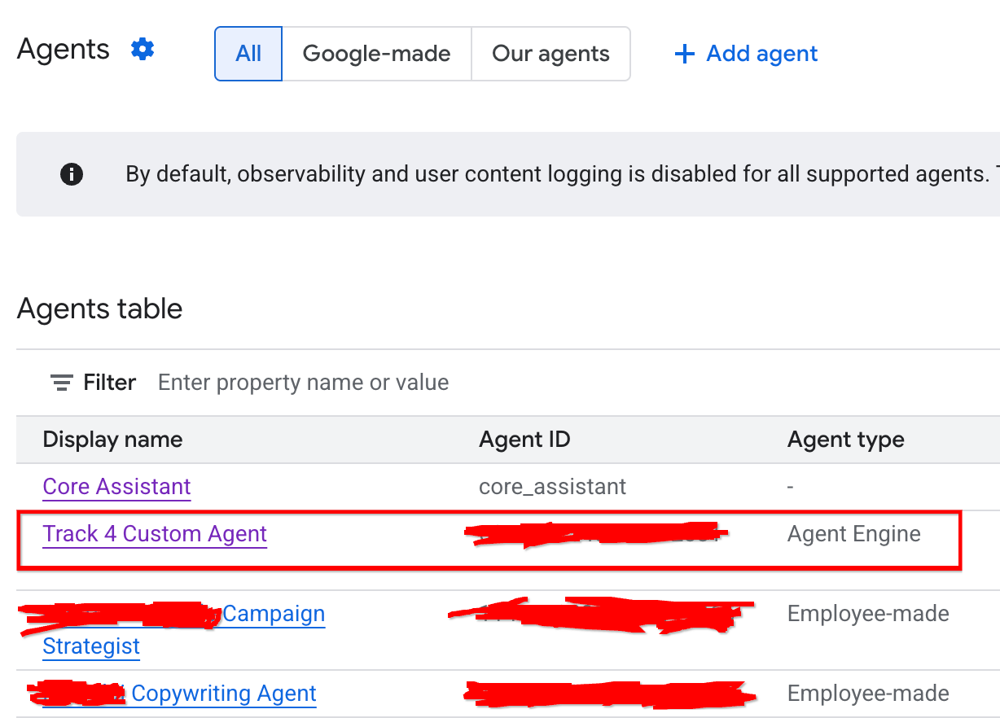 |  |
| Cloud Console의 Agents table에 `Track 4 Custom Agent`가 `Agent Engine`으로 등록된 상태 | 사내 임직원이 Agents 메뉴에서 선택하여 대화를 시작할 수 있는 초기 화면 |
